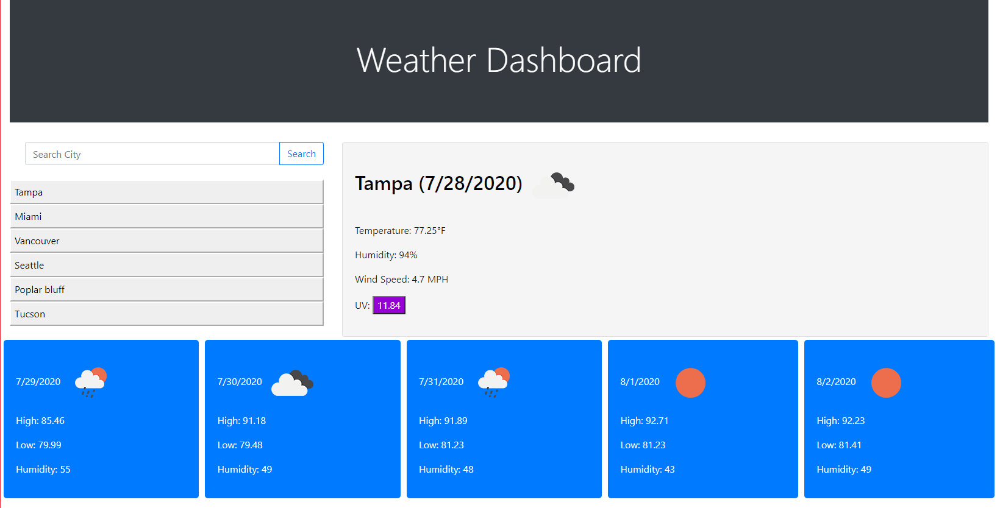

# Weather Dashboard

This is a Weath Dashboard application. It runs in the broweser and is powered by HTML, CSS, and Javascript. This application will give the user the current weather and also a five day forecast.

## Functionality

The user simply types in a city in the search blocks and clicks search. The main container will display the current weather including the UV index which changes color depending on the value of the UV. It also gives the user a five day forecast at the bottome of the page in the form of cards. Searches are saved below the search box and can be clicked to show the info for that city.

## Image

